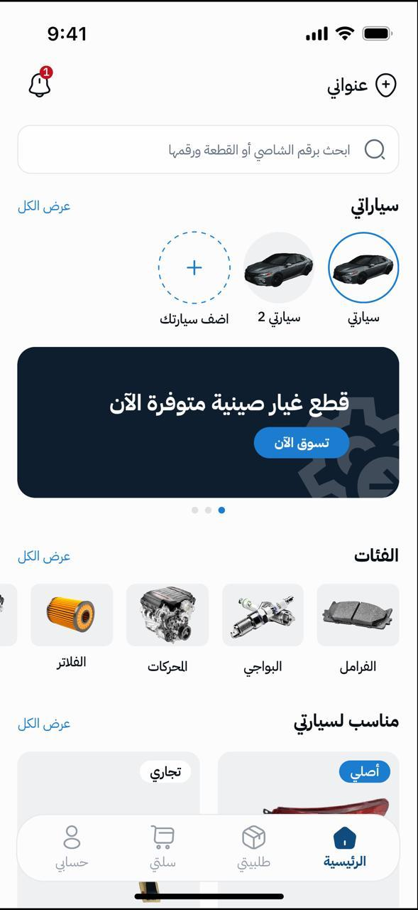
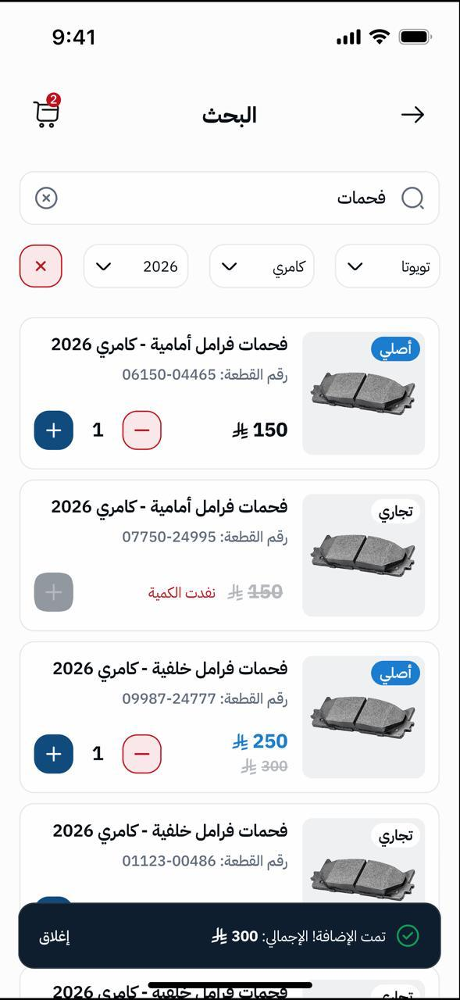

# Qitai | قطعي 🚗🛒

Qitai is a modern automotive e-commerce mobile application specialized in selling spare parts directly to consumers. The application is designed from scratch focusing on scalability, high performance, and long-term maintainability.

> 🛠️ **Status:** Under Active Development 🚀

---

## 🏗️ Architecture & State Management

To ensure the codebase remains scalable and easy to test as the app grows, the project follows:
- **Feature-First (Feature-Based) Structure:** Keeping all presentation, domain, and data layers scoped within specific features.
- **Clean Architecture Principles:** Separation of concerns, making the app independent of external frameworks and databases.
- **Riverpod:** Used as the core state management solution for predictable state flow, dependency injection, and decoupling logic from the UI.

---

## 🛠️ Tech Stack & Libraries

- **Framework:** Flutter & Dart
- **State Management:** Riverpod (Notifier, FutureProvider, StateProvider)
- **Networking:** Dio (with interceptors for advanced logging and token management)
- **Local Storage:** Hive / Secure Storage (for caching and user session handling)
- **Design System:** Figma to responsive, pixel-perfect Flutter widgets

---

## 🎯 Key Roadmap & Upcoming Milestones

As the project progresses, the following production-grade integrations are being prepared:
- [ ] **Google Maps API:** For dynamic delivery tracking and workshop location services.
- [ ] **Firebase Ecosystem:** Integrating **Firebase Cloud Messaging (FCM)** for Push Notifications and analytics.
- [ ] **Authentication:** Transitioning to a secure **OTP Service** for modern user onboarding.
- [ ] **Payment Gateways:** Integrating secure payment solutions (Mada, Visa, Apple Pay).

---

## 📱 Features Implemented So Far
- Responsive and modern UI based on strict Figma guidelines.
- Clean API data modeling and robust error-handling mechanisms.
- Scalable state management architecture set up for all future modules.

